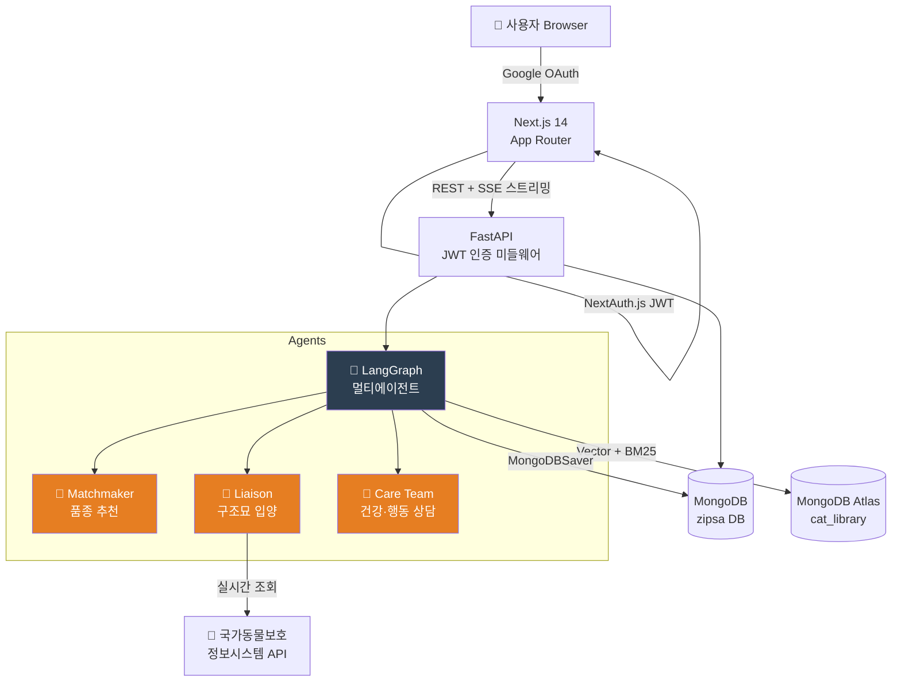
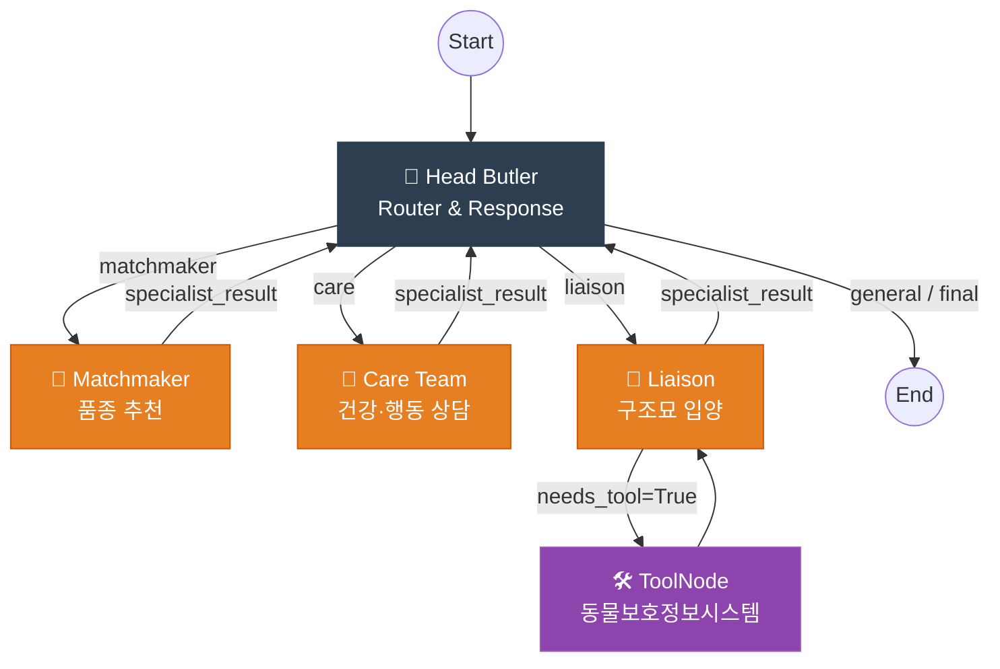
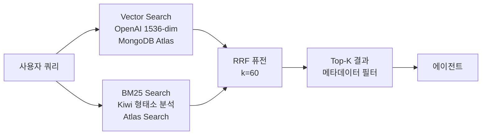
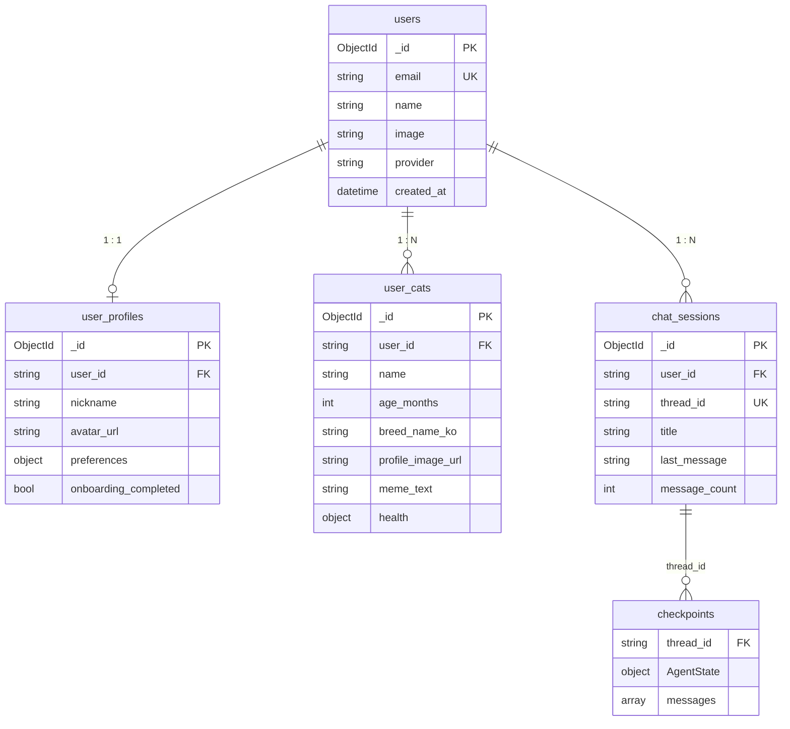

<div align="center">

# ZIPSA 시스템 아키텍처

**AI 기반 고양이 품종 매칭 & 케어 상담 웹 서비스**


</div>

---

## 1. 전체 시스템 구성



### 레이어 요약

| 레이어 | 기술 | 역할 |
|--------|------|------|
| **프론트엔드** | Next.js 14 (App Router) | UI 렌더링, Google OAuth, SSE 수신 |
| **인증** | NextAuth.js + FastAPI JWT | OAuth 플로우 → JWT 발급 → API 인가 |
| **백엔드** | FastAPI + LangGraph | REST API, SSE 스트리밍, 멀티에이전트 오케스트레이션 |
| **AI** | LangChain + GPT-4o-mini | 라우팅, 응답 생성, Vision AI |
| **데이터** | MongoDB Atlas | 유저 데이터 + 세션 + 체크포인트 + 품종 벡터 DB |
| **외부 API** | 국가동물보호정보시스템 | 구조동물 실시간 조회 |

---

## 2. 프론트엔드 아키텍처

### 2-1. 디렉토리 구조

```
frontend/src/
├── app/                     # Next.js App Router
│   ├── layout.tsx           # Root layout (SessionProvider)
│   ├── page.tsx             # 랜딩 페이지
│   ├── login/page.tsx       # Google 로그인
│   ├── onboarding/page.tsx  # 집사 환경 설문 🔒
│   ├── chat/
│   │   ├── new/page.tsx     # 세션 생성 후 리다이렉트 🔒
│   │   └── [id]/page.tsx    # 채팅 세션 (SSE · CatCard) 🔒
│   ├── my-cats/
│   │   ├── page.tsx         # 내 고양이 목록 🔒
│   │   └── [id]/page.tsx    # 고양이 수정 🔒
│   ├── meme/page.tsx        # 냥심 번역기 🔒
│   └── profile/page.tsx     # 내 프로필 설정 🔒
├── components/
│   ├── layout/
│   │   ├── Navigation.tsx   # 상단 네비게이션 (프로필 뱃지, 드롭다운)
│   │   └── GlobalDrawer.tsx # 좌측 세션 히스토리 슬라이딩 서랍
│   ├── ui/                  # shadcn/ui 기본 컴포넌트
│   ├── CatCard.tsx          # 품종 추천 카드
│   ├── RescueCatCard.tsx    # 구조묘 카드
│   └── UserCatCard.tsx      # 내 고양이 카드
├── lib/
│   └── api.ts               # 모든 API 호출 함수 + 타입 정의
├── store/
│   └── zipsa.ts             # Zustand 전역 상태 (profile, sessions)
└── middleware.ts             # 인증 보호 경로

🔒 = 미인증 시 /login 리다이렉트
```

### 2-2. Zustand 상태 관리

```typescript
interface ZipsaStore {
  profile: UserProfileResponse | null;  // 온보딩 프로필 (채팅 컨텍스트 주입용)
  sessions: ChatSession[];              // 사이드바 세션 목록

  // Actions
  setProfile / setSessions / reset
  addSession / updateSession / removeSession
  loadProfile(token) / loadSessions(token)
}
```

- 앱 진입 시 `StoreInitializer`가 `loadProfile` + `loadSessions` 1회 호출
- 로그아웃 시 `reset()` → OAuth 세션과 함께 메모리 상태 초기화
- `profile`은 스트리밍 요청 시 `user_profile`로 에이전트에 주입

### 2-3. 채팅 페이지 레이아웃

```
┌─────────────────────────────┬────────────────────────┐
│  채팅 영역                   │  우측 패널             │
│                             │                        │
│  [Z] AI 말풍선               │  참고 출처 (rag_docs)  │
│      react-markdown 렌더링  │                        │
│      BreedPopover 인라인    │  ┌──────────────────┐  │
│                             │  │  CatCard         │  │
│  [사용자] 말풍선             │  │  or              │  │
│                             │  │  RescueCatCard   │  │
│  [스트리밍 중 로딩 점점]      │  └──────────────────┘  │
│                             │                        │
│  [입력창]  [전송]            │  탭: 추천품종 / 구조묘  │
└─────────────────────────────┴────────────────────────┘
```

---

## 3. 백엔드 아키텍처

### 3-1. FastAPI 구조

```
src/
├── main.py                  # FastAPI 앱 + static 파일 서빙
├── api/
│   ├── dependencies.py      # get_current_user (JWT 검증)
│   └── routers/
│       ├── auth.py          # POST /auth/sync, GET /auth/me
│       ├── users.py         # GET/POST/PUT /users/me/profile
│       ├── cats.py          # CRUD /users/me/cats, 이미지 업로드
│       ├── sessions.py      # CRUD /users/me/sessions, 메시지 목록
│       ├── chat.py          # POST /chat/invoke, POST /chat/stream
│       └── meme.py          # POST /meme/analyze (Vision AI)
├── agents/
│   ├── graph.py             # LangGraph StateGraph 정의
│   ├── state.py             # AgentState (messages, recommendations, ...)
│   ├── head_butler.py       # 라우터 & 응답 합성
│   ├── matchmaker.py        # 품종 추천
│   ├── care_team.py         # 건강·행동 상담
│   ├── liaison.py           # 구조묘 입양 안내
│   └── tools/               # 국가동물보호정보시스템 Tool
├── core/
│   ├── config.py            # LLMConfig, TokenConfig, ZipsaConfig
│   ├── models/              # Pydantic 모델 (chat, user, cat, meme)
│   ├── prompts/             # prompts.yaml + PromptManager
│   ├── token_utils.py       # 히스토리 트리밍
│   └── fallbacks.py         # Fallback 메시지
└── retrieval/
    └── hybrid_search.py     # Vector + BM25 + RRF 검색
```

### 3-2. API 엔드포인트

| 메서드 | 경로 | 설명 |
|--------|------|------|
| `POST` | `/api/v1/auth/sync` | Google OAuth 동기화 + JWT 발급 |
| `GET`  | `/api/v1/auth/me` | 현재 로그인 유저 정보 |
| `GET`  | `/api/v1/users/me/profile` | 프로필 조회 |
| `POST` | `/api/v1/users/me/profile` | 프로필 생성 (온보딩 완료) |
| `PUT`  | `/api/v1/users/me/profile` | 프로필 수정 |
| `GET`  | `/api/v1/users/me/cats` | 내 고양이 목록 |
| `POST` | `/api/v1/users/me/cats` | 고양이 등록 |
| `PUT`  | `/api/v1/users/me/cats/{id}` | 고양이 수정 |
| `DELETE` | `/api/v1/users/me/cats/{id}` | 고양이 삭제 |
| `POST` | `/api/v1/users/me/cats/upload-image` | 이미지 업로드 |
| `GET`  | `/api/v1/users/me/sessions` | 세션 목록 |
| `POST` | `/api/v1/users/me/sessions` | 세션 생성 |
| `DELETE` | `/api/v1/users/me/sessions/{id}` | 세션 삭제 |
| `GET`  | `/api/v1/users/me/sessions/{id}/messages` | 메시지 목록 |
| `POST` | `/api/v1/chat/stream` | SSE 스트리밍 응답 |
| `POST` | `/api/v1/meme/analyze` | Vision AI 냥심 번역기 |

---

## 4. LangGraph 멀티에이전트 시스템

### 4-1. 에이전트 그래프



### 4-2. Head Butler (라우터 & 응답 합성기)

- **모델**: `gpt-4.1-nano` (라우팅) / `gpt-4o-mini` (응답 생성)
- **구조화 출력**: `RouterDecision` Pydantic 모델 → `matchmaker | liaison | care | general`
- **재방문 처리**: `specialist_result` 수신 시 `tool_output` 제외 후 최종 응답 생성
- **일반 질문**: `general` 분류 시 직접 응답 → END

### 4-3. 전문가 노드

| 에이전트 | 기능 | RAG 필터 | 주요 출력 |
|----------|------|----------|-----------|
| **Matchmaker** | 품종 추천 (Agentic Selection: 10개 후보 → LLM top 3 선별) | `specialist="Matchmaker"`, `categories="Breeds"` | `recommendations` (CatCard 데이터) |
| **Liaison** | 구조묘 조회 + 입양 안내 | `specialist="Liaison"` | `rescue_cats` (RescueCatCard 데이터) |
| **Care Team** | 건강(Physician) / 행동(Peacekeeper) 내부 서브라우팅 | `specialist="Physician|Peacekeeper"` | `rag_docs` (출처 패널) |

### 4-4. AgentState

```python
class AgentState(TypedDict):
    messages: Annotated[list, add_messages]  # 대화 히스토리
    user_profile: dict                        # 온보딩 설문 데이터
    router_decision: str | None              # 라우팅 결과
    specialist_result: dict | None           # 전문가 보고서 JSON
    recommendations: list                    # 품종 추천 카드 데이터
    rescue_cats: list                        # 구조묘 카드 데이터
    rag_docs: list                           # 참고 출처 문서
```

### 4-5. 세션 영속성 (MongoDBSaver)

```
chat_sessions 컬렉션          checkpoints 컬렉션
─────────────────────         ──────────────────────────────
_id (= thread_id)             thread_id  (← session_id)
user_id                       전체 messages 배열
title (첫 메시지 자동 생성)    recommendations, rescue_cats
last_message                  rag_docs, user_profile
message_count                 ...AgentState 전체
updated_at
```

- `thread_id = session_id` 동일하게 유지 → 대화 맥락 자동 복원
- 메시지 복원 시 `ToolMessage` 및 빈 `AIMessage` 필터링 (raw JSON 방지)

---

## 5. 인증 흐름

```
1. 사용자 "Google로 로그인" 클릭
        ↓
2. NextAuth.js → Google OAuth 인증
        ↓
3. NextAuth.js signIn 콜백 → POST /api/v1/auth/sync
   { google_id, email, name, avatar_url }
        ↓
4. FastAPI: users 컬렉션 upsert + JWT 발급 (24h)
   응답: { access_token, user_id }
        ↓
5. JWT를 NextAuth.js session.zipsa_token 에 저장
        ↓
6. 이후 모든 API 요청: Authorization: Bearer {jwt}
   FastAPI get_current_user 의존성으로 검증
```

> NextAuth.js는 OAuth 플로우만 담당. 유저 데이터는 FastAPI의 자체 MongoDB에서 관리 (NextAuth MongoDB Adapter 미사용).

---

## 6. SSE 스트리밍 채팅

### 6-1. 이벤트 구조

```
POST /api/v1/chat/stream  →  text/event-stream

data: {"type": "token",           "content": "서울"}
data: {"type": "token",           "content": " 강동구"}
...
data: {"type": "rescue_cats",     "data": [{animal_id, breed, ...}]}
data: {"type": "recommendations", "data": [{name_ko, image_url, ...}]}
data: {"type": "rag_docs",        "data": [{title, source, url}]}
data: [DONE]
```

| 이벤트 타입 | 처리 |
|------------|------|
| `token` | 말풍선에 실시간 append |
| `rescue_cats` | 우측 패널 RescueCatCard 업데이트 |
| `recommendations` | 우측 패널 CatCard 업데이트 |
| `rag_docs` | 우측 패널 출처 목록 업데이트 |

### 6-2. 내부 LLM 호출 필터링

`astream_events v2`에서 `router_classification` 태그로 내부 라우팅 LLM 호출을 필터링 → 최종 응답 토큰만 스트리밍.

---

## 7. Hybrid RAG 검색 엔진



- **Vector Search**: `text-embedding-3-small` 1536차원 임베딩
- **BM25**: Kiwi 한국어 형태소 분석 + 도메인 사전 (~1,100개 용어)
- **RRF (k=60)**: 두 결과를 Reciprocal Rank Fusion으로 통합
- **메타데이터 필터**: `specialist` + `categories` 필드로 에이전트별 문서 라우팅

---

## 8. 데이터베이스 스키마



---

## 9. 냥심 번역기 (Vision AI)

```
사진 업로드 (drag & drop)
  + 선택적 텍스트 힌트
        ↓
POST /api/v1/meme/analyze
  → 이미지 base64 → gpt-4o-mini Vision
  → JSON 구조화 응답: { meme_text, breed_guess, age_guess }
  → 이미지 static/meme/{uuid}.jpg 저장
        ↓
폴라로이드 결과 카드
  밈 텍스트 (italic) + 품종/나이 뱃지
        ↓
"내 고양이로 등록" → AlertDialog
  breed_guess, age_guess 자동 파싱 채움
  → POST /users/me/cats → /my-cats 리다이렉트
```

---

## 10. 기술 스택 전체 목록

**Backend**

| 구분 | 기술 | 역할 |
|------|------|------|
| 서버 | FastAPI | REST API · SSE 스트리밍 · JWT 인증 미들웨어 |
| AI | LangChain + LangGraph | 멀티에이전트 오케스트레이션 |
| LLM | gpt-4.1-nano / gpt-4o-mini | 라우팅 / 응답 생성 · Vision AI |
| DB | MongoDB Atlas | Vector Search + BM25 하이브리드 검색 |
| 세션 | LangGraph MongoDBSaver | 대화 맥락 체크포인트 영속화 |
| 검색 | Kiwipiepy | 한국어 형태소 분석 (~1,100개 도메인 사전) |
| 외부 API | 국가동물보호정보시스템 | 구조동물 실시간 조회 |
| 모니터링 | LangSmith | 에이전트 트레이싱 |

**Frontend**

| 구분 | 기술 | 역할 |
|------|------|------|
| 프레임워크 | Next.js 14 App Router | 풀스택 렌더링 · 미들웨어 보호 경로 |
| 인증 | NextAuth.js | Google OAuth 플로우 · 세션 쿠키 |
| 상태 관리 | Zustand | 프로필 · 세션 목록 전역 관리 |
| 스타일링 | Tailwind CSS + shadcn/ui | 디자인 시스템 |
| 마크다운 | react-markdown | AI 응답 굵기·목록·링크 렌더링 |
| 스트리밍 | Server-Sent Events | 토큰 · 카드 데이터 실시간 수신 |

---

*develop branch · 2026-03-03*
