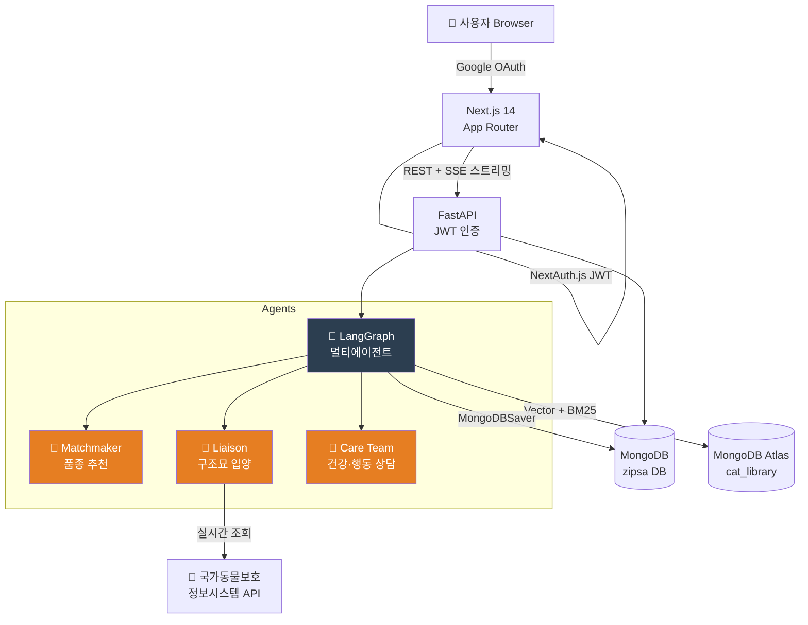
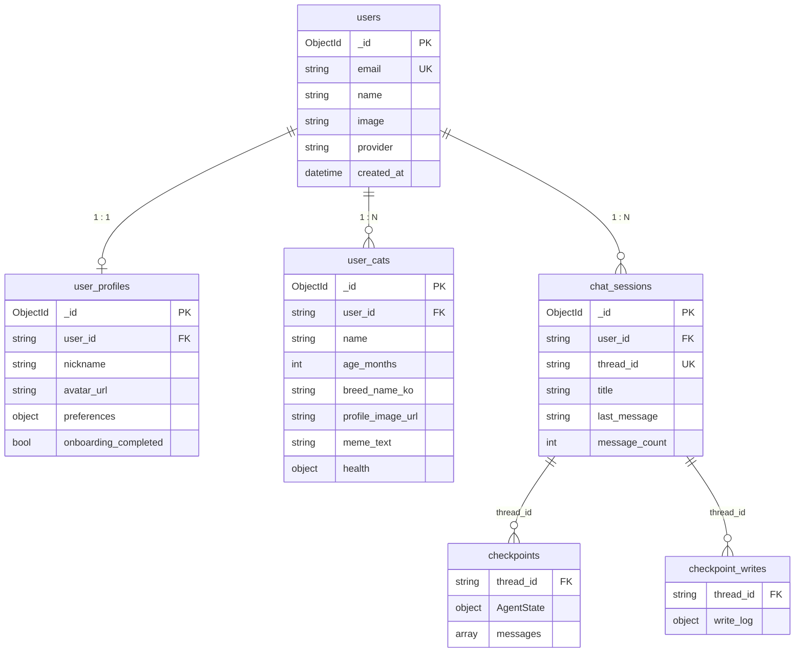

<div align="center">

# 🏰 ZIPSA 집사

**AI 기반 고양이 품종 매칭 & 케어 상담 웹 서비스**

*"완벽한 집사가 되는 길, 당신 곁에는 가장 스마트한 AI 파트너가 있습니다."*

<br/>


<br/>

| 🐱 67종 품종 추천 | 🤖 4인 AI 전문가팀 | 🏠 구조묘 실시간 연동 | 📸 냥심 번역기 |
|:-:|:-:|:-:|:-:|
| 세밀한 특성 데이터 기반 매칭 | Head Butler · Matchmaker · Liaison · Care | 국가동물보호정보시스템 API | Vision AI 폴라로이드 밈 |

</div>

---

## 📌 서비스 소개

고양이 파양의 주요 원인은 **사전 정보 부족과 미스매칭**입니다.
ZIPSA는 집사의 라이프스타일을 분석해 최적의 품종을 추천하고, 입양부터 일상 케어까지 AI 전문가팀이 함께합니다.

```
집사님의 일상 입력  →  AI 분석  →  맞춤 품종 추천 · 구조묘 연결 · 케어 상담
```

---

## 🏗️ 아키텍처



---

## 💻 기술 스택

**Backend**


| 구분 | 기술 | 역할 |
|------|------|------|
| 서버 | FastAPI | REST API · SSE 스트리밍 · JWT 인증 미들웨어 |
| AI | LangChain + LangGraph | 멀티에이전트 오케스트레이션 |
| LLM | gpt-4.1-nano / gpt-4o-mini | 라우팅 / 응답 생성 · Vision AI |
| DB | MongoDB Atlas | Vector Search + BM25 하이브리드 검색 |
| 세션 | LangGraph MongoDBSaver | 대화 맥락 체크포인트 영속화 |
| 외부 | 국가동물보호정보시스템 | 구조동물 실시간 조회 |
| 모니터링 | LangSmith | 에이전트 트레이싱 |

**Frontend**


| 구분 | 기술 | 역할 |
|------|------|------|
| 프레임워크 | Next.js 14 App Router | 풀스택 렌더링 · 미들웨어 보호 경로 |
| 인증 | NextAuth.js | Google OAuth 플로우 · 세션 쿠키 |
| 상태 관리 | Zustand | 프로필 · 세션 목록 전역 관리 |
| 스타일링 | Tailwind CSS + shadcn/ui | 디자인 시스템 |
| 마크다운 | react-markdown | AI 응답 굵기·목록·링크 렌더링 |
| 스트리밍 | Server-Sent Events | 토큰 · 카드 데이터 실시간 수신 |

---

## 🗺️ 페이지 구조

```
/                    랜딩 페이지
├── /login           Google SSO 로그인
├── /onboarding      집사 환경 설문 (최초 1회) 🔒
├── /chat            새 대화 생성 🔒
│   └── /chat/[id]   채팅 세션 (SSE · CatCard · RescueCatCard) 🔒
├── /my-cats         내 고양이 목록 · 등록 🔒
├── /meme            냥심 번역기 (Vision AI) 🔒
└── /profile         내 프로필 설정 🔒

🔒 = 미인증 시 /login 리다이렉트
```

---

## 🔌 API 엔드포인트

> 전체 명세 → [`docs/08_backend/zipsa_openapi.yaml`](docs/08_backend/zipsa_openapi.yaml)
> 로컬 Swagger UI → `http://localhost:8000/docs`

<details>
<summary><b>Auth</b></summary>

| 메서드 | 경로 | 설명 |
|--------|------|------|
| `POST` | `/api/v1/auth/sync` | Google OAuth 동기화 + JWT 발급 |
| `GET`  | `/api/v1/auth/me`   | 현재 로그인 유저 정보 |

</details>

<details>
<summary><b>User Profile</b></summary>

| 메서드 | 경로 | 설명 |
|--------|------|------|
| `GET`  | `/api/v1/users/me/profile` | 프로필 조회 |
| `POST` | `/api/v1/users/me/profile` | 프로필 생성 (온보딩 완료) |
| `PUT`  | `/api/v1/users/me/profile` | 프로필 수정 |
| `POST` | `/api/v1/users/me/profile/avatar/presign` | 아바타 업로드 URL 발급 |

</details>

<details>
<summary><b>User Cats</b></summary>

| 메서드 | 경로 | 설명 |
|--------|------|------|
| `GET`    | `/api/v1/users/me/cats` | 내 고양이 목록 |
| `POST`   | `/api/v1/users/me/cats` | 고양이 등록 |
| `GET`    | `/api/v1/users/me/cats/{cat_id}` | 고양이 상세 |
| `PUT`    | `/api/v1/users/me/cats/{cat_id}` | 고양이 수정 |
| `DELETE` | `/api/v1/users/me/cats/{cat_id}` | 고양이 삭제 |
| `POST`   | `/api/v1/users/me/cats/upload-image` | 프로필 이미지 업로드 |

</details>

<details>
<summary><b>Chat Sessions</b></summary>

| 메서드 | 경로 | 설명 |
|--------|------|------|
| `GET`    | `/api/v1/users/me/sessions` | 세션 목록 |
| `POST`   | `/api/v1/users/me/sessions` | 세션 생성 |
| `GET`    | `/api/v1/users/me/sessions/{session_id}` | 세션 상세 |
| `DELETE` | `/api/v1/users/me/sessions/{session_id}` | 세션 삭제 |
| `GET`    | `/api/v1/users/me/sessions/{session_id}/messages` | 메시지 목록 |

</details>

<details>
<summary><b>Chat & Meme</b></summary>

| 메서드 | 경로 | 설명 |
|--------|------|------|
| `POST` | `/api/v1/chat/invoke` | 동기 채팅 응답 |
| `POST` | `/api/v1/chat/stream` | SSE 스트리밍 응답 |
| `POST` | `/api/v1/meme/analyze` | Vision AI 냥심 번역기 |

</details>

---

## 🗄️ MongoDB 스키마

> 전체 명세 → [`docs/05_data/mongodb_user_schema.md`](docs/05_data/mongodb_user_schema.md)



---

## 🚀 시작하기

### 1. 환경 변수 설정

```bash
cp .env.example .env
```

```env
# OpenAI
OPENAI_API_KEY=sk-...

# MongoDB Atlas
MONGO_V3_URI=mongodb+srv://...

# 국가동물보호정보시스템
OPENAPI_API_KEY=...

# LangSmith (선택)
LANGCHAIN_API_KEY=...
LANGCHAIN_TRACING_V2=true
```

```env
# frontend/.env.local
NEXTAUTH_URL=http://localhost:3000
NEXTAUTH_SECRET=...
GOOGLE_CLIENT_ID=...
GOOGLE_CLIENT_SECRET=...
NEXT_PUBLIC_API_URL=http://localhost:8000
```

### 2. 백엔드 실행

```bash
pip install -r requirements.txt
uvicorn src.main:app --reload --port 8000
# → http://localhost:8000/docs
```

### 3. 프론트엔드 실행

```bash
cd frontend
npm install
npm run dev
# → http://localhost:3000
```

---

## 📚 문서

| 문서 | 경로 |
|------|------|
| 시스템 아키텍처 | [`docs/02_system_architecture/`](docs/02_system_architecture/) |
| API 명세 (OpenAPI 3.0) | [`docs/08_backend/zipsa_openapi.yaml`](docs/08_backend/zipsa_openapi.yaml) |
| MongoDB 스키마 | [`docs/05_data/mongodb_user_schema.md`](docs/05_data/mongodb_user_schema.md) |
| 페이지 명세 | [`docs/09_frontend/app_router_spec.md`](docs/09_frontend/app_router_spec.md) |
| 에이전트 테스트 시나리오 | [`docs/06_feature/`](docs/06_feature/) |
| 발표 자료 | [`docs/07_report/presentation.md`](docs/07_report/presentation.md) |

---

## 👥 팀

<table>
<tr>
<td align="center" width="33%">
<b>limdo</b><br/>
메인 개발<br/>
<sub>웹 전체 설계 및 구현<br/>FastAPI · Next.js · LangGraph</sub>
</td>
<td align="center" width="33%">
<b>minho8234</b><br/>
AI & 기획<br/>
<sub>테스트 시나리오<br/>랜딩 페이지 기획</sub>
</td>
<td align="center" width="33%">
<b>fleshflamer-commits</b><br/>
보안 & 기획<br/>
<sub>프롬프트 인젝션 방어 테스트<br/>랜딩 페이지 기획</sub>
</td>
</tr>
</table>
