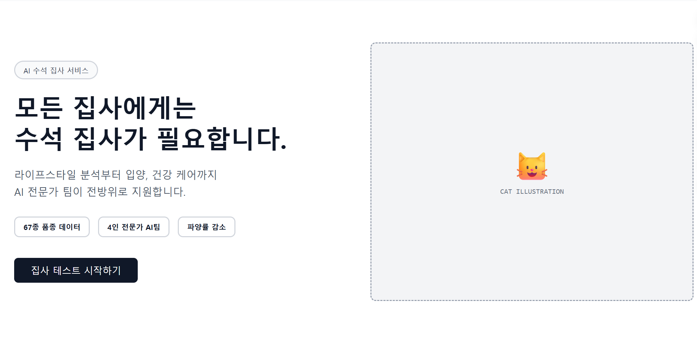
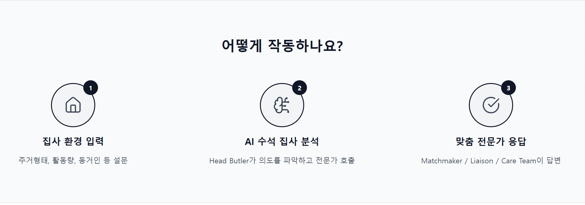
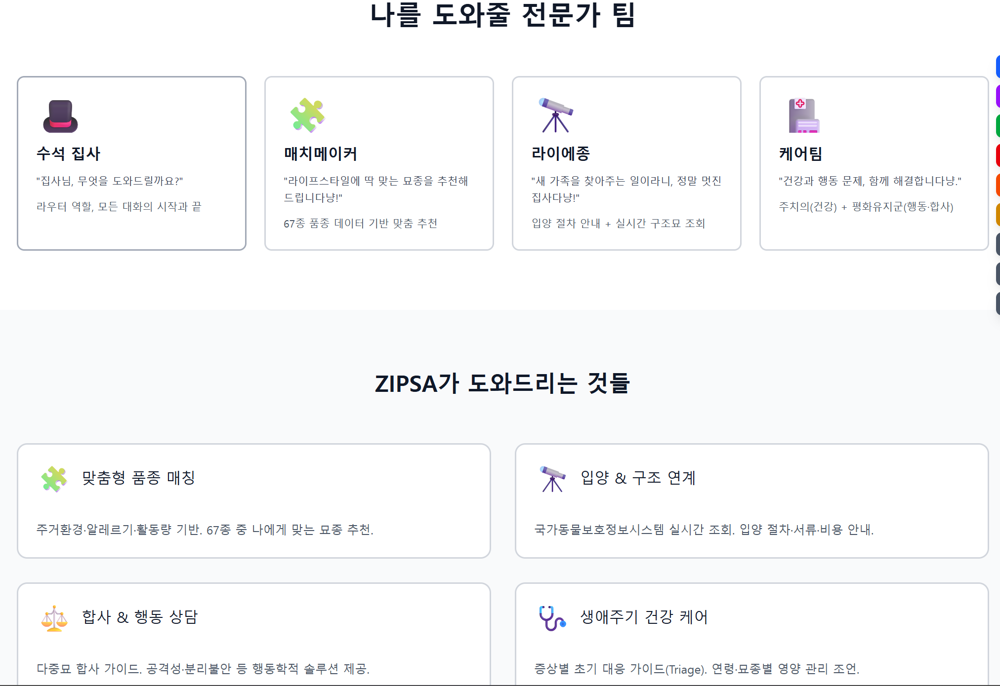
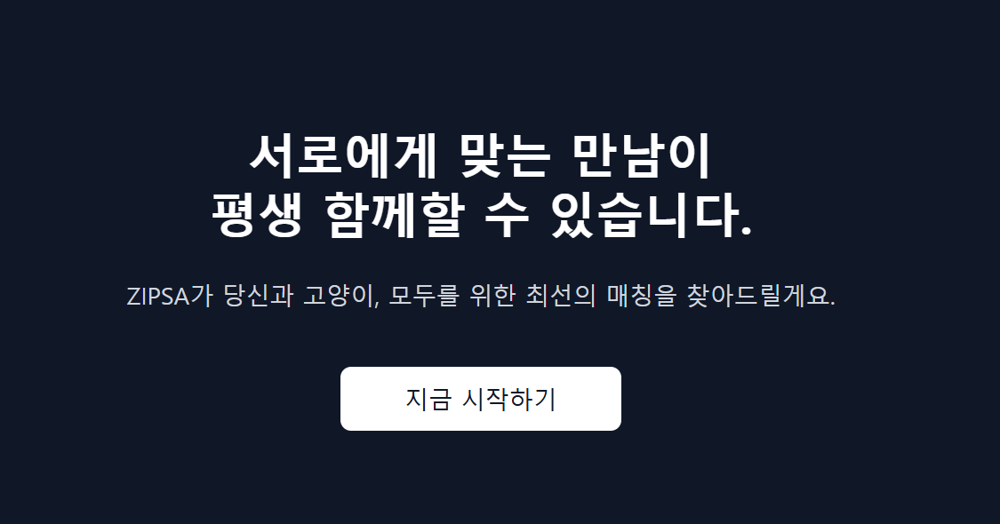

## 전문성은 유지하되, 표현을 '수석'이라는 수직적 관계에서 '파트너'라는 수평적 관계로 변경합니다.

- 메인 카피: "완벽한 집사가 되는 길, 당신 곁에는 가장 스마트한 AI 파트너가 있습니다."

- 서브 카피: "라이프스타일 분석으로 찾는 최적의 입양부터 정밀 건강 케어까지, AI 전문가 팀의 데이터가 당신의 반려 생활을 
지원합니다."

* * 67종 품종 데이터  >	67종 품종 추천
  * 4인 전문가 AI팀	  >  4인 AI 전문가	
  * 파양률 감소	 >  행복한 첫 만남

- 버튼: "행복한 만남의 첫걸음"



## 어떻게 작동하나요? > 우리 아이를 위한 맞춤 케어, 이렇게 진행돼요?

1.집사 환경 입력 > 집사님의 일상을 들려주세요. (함께 사는 가족, 집 안 환경, 활동량 등)

2.AI 수석 집사 분석 > 데이터로 최적의 솔루션을 찾아요 (Head Butler가 집사님의 마음을 읽고, AI 전문가 팀을 구성합니다.)

3.맞춤 전문가 응답 > 전문가의 맞춤 처방이 시작됩니다.(Matchmaker / Liaison / Care Team이 맞춤 처방)



## 전문가팀 & ZIPSA 통합 

* 함께라서 더 행복한 집사 일지

```
-  [준비] "집사님의 일상을 들려주세요"
-  담당 전문가: 수석 집사 (모든 대화의 시작과 끝을 담당)

- "반가워요, 예비 집사님! 어떤 곳에서 누구와 함께 사시나요? 집사님의 소중한 생활 패턴을 알려주시면, 수석 집사가 가장 편안한 반려 생활을 설계해 드릴게요."

- 포함 내용: 주거 환경, 활동량, 동거인 및 알레르기 유무 확인

```
```
- [인연] "운명의 묘연을 찾아드릴게요"
- 담당 전문가: 매치메이커 (67종 데이터 기반 맞춤 추천)

-  "세상에 나쁜 고양이는 없지만, 집사님과 찰떡궁합인 아이는 있답니다! 67종의 세밀한 데이터를 분석해 집사님의 성향과 딱 맞는 '묘연'을 콕 집어 추천해 드린다냥!"

- 포함 내용: 맞춤형 품종 매칭 및 성격 적합도 분석
```
```
- [만남] "설레는 첫 만남을 함께해요"
- 담당 전문가: 라이에종 (입양 절차 및 실시간 정보 안내)

- "마음에 쏙 드는 아이를 찾으셨나요? 가족을 맞이하는 길은 복잡하지 않아야 해요. 실시간 보호 정보 조회부터 까다로운 입양 서류 안내까지, 라이에종이 곁에서 꼼꼼히 챙겨줄게요!"

- 국가동물보호정보시스템 연계, 입양 절차 및 비용 가이드
```
```
- [동행] "365일 든든한 지원군이 될게요"
- 담당 전문가: 케어팀 (건강 및 행동 상담의 수호자)

- "이제 진짜 시작이에요! 합사 문제로 고민될 때나 아이 건강이 걱정될 때 언제든 불러주세요. 행동 전문가와 건강 주치의가 집사님의 든든한 백업 팀이 되어 우리 아이의 평생 행복을 지켜줄게요."

- 포함 내용: 다중묘 합사 가이드, 행동학적 솔루션, 생애주기별 건강 관리
```



## 당신과 고양이의 행복한 동행을 위한 AI 가이드

"행복한 반려 생활의 시작은 서로에 대해 잘 아는 것부터"
